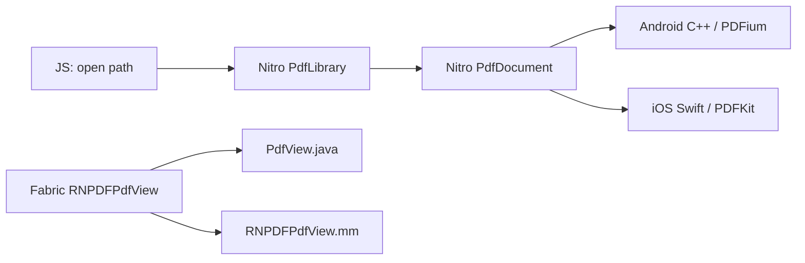

# Architecture

```mermaid
flowchart LR
  JS["JS: open path"] --> Lib["Nitro PdfLibrary"]
  Lib --> Doc["Nitro PdfDocument"]
  Doc --> Android["Android C++ / PDFium"]
  Doc --> IOS["iOS Swift / PDFKit"]
  View["Fabric RNPDFPdfView"] --> AndroidView["PdfView.java"]
  View --> IOSView["RNPDFPdfView.mm"]
```

The view does not call the hybrid. Search inside the view uses `SearchRegistry`, which the view fills from its `path` prop. Programmatic search uses `PdfDocument.searchText`.
